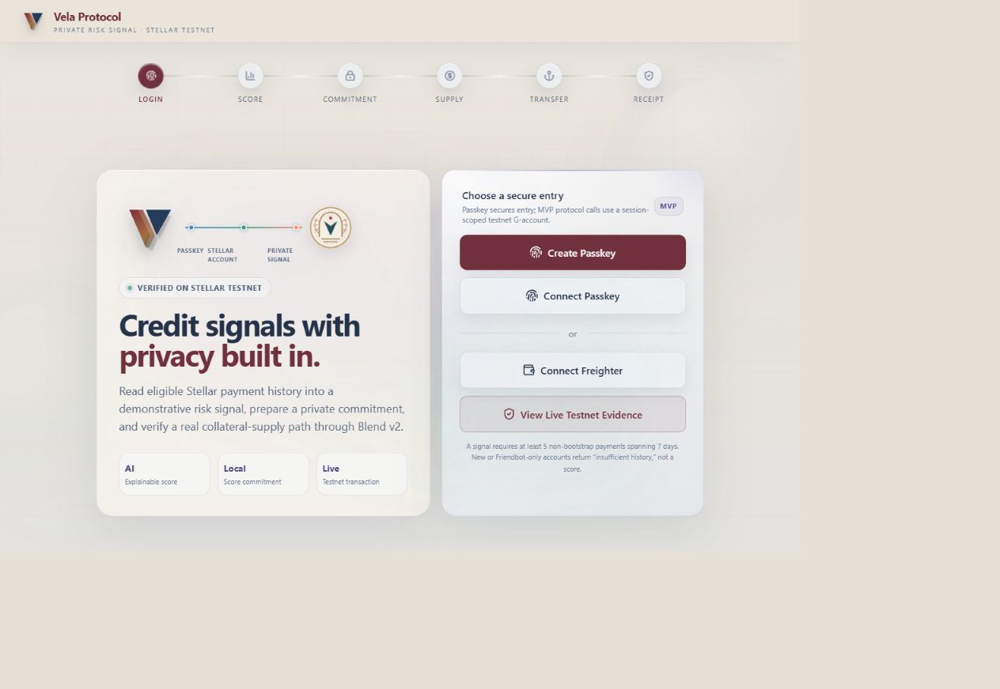
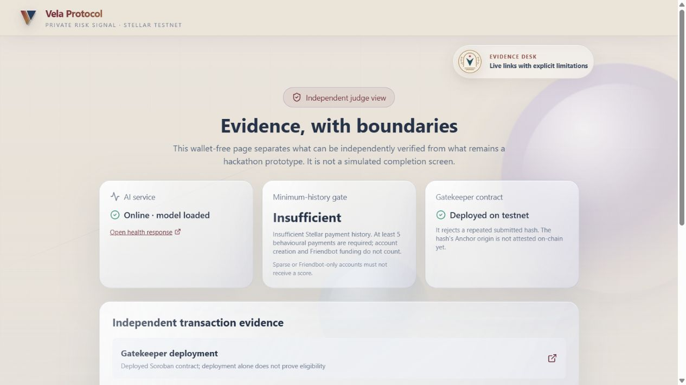
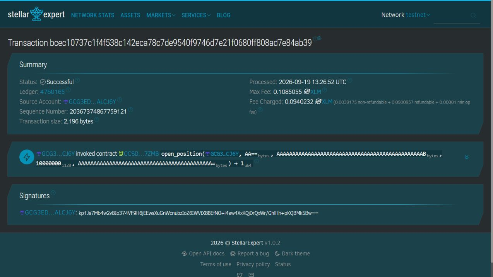
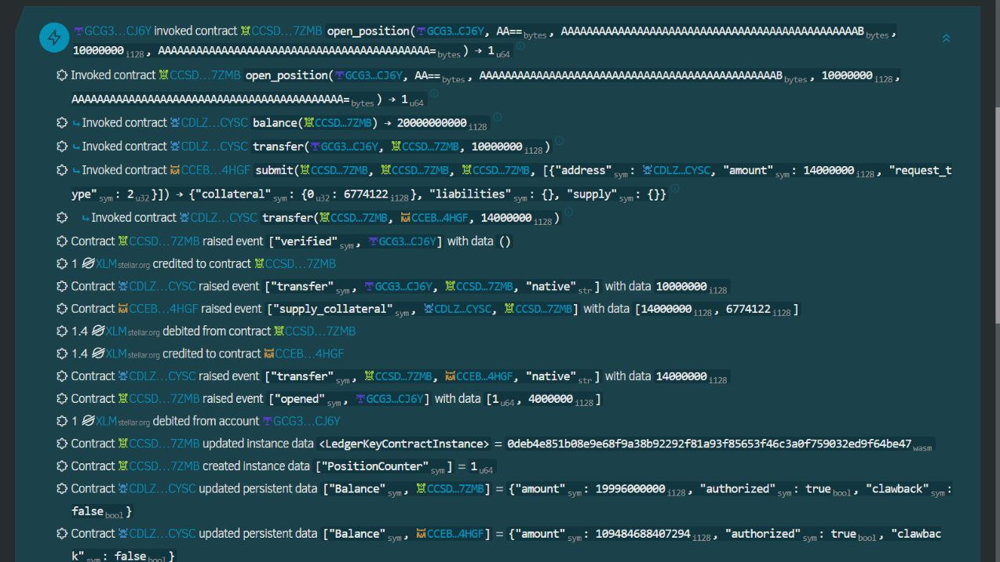

# Vela Protocol

Vela is a Stellar testnet prototype for privacy-aware risk signals, submitted identity-hash replay protection, Blend v2 collateral supply, and Anchor SEP integrations.

- Live frontend: https://vela-protocol-n9kf.vercel.app
- Live evidence page: https://vela-protocol-n9kf.vercel.app/evidence
- Live AI scoring API: https://vela-ai-scoring.vercel.app/health
- Source and setup: [vela-protocol/README.md](vela-protocol/README.md)
- Gatekeeper contract: `CCSDVXSUOS2P7PJZASQ7XZ27BYOMRWUNJPBMBK3AMF6PFWXT5VPU7ZMB`
- Testnet transaction: https://stellar.expert/explorer/testnet/tx/bcec10737c1f4f538c142eca78c7de9540f9746d7e21f0680ff808ad7e84ab39

The static frontend is deployed on Vercel. The AI scoring service runs separately as a FastAPI process; see the setup guide for local development and deployment requirements.

## Demo evidence

The screenshots below were captured from the live deployment and Stellar testnet on 19 September 2026. They are presentation evidence, not mocked completion screens.

### Live experience

The public evidence page checks the live scoring service, shows that a sparse account fails the minimum-history gate, and links directly to testnet transactions.

### Verified Stellar transaction

The published fixture is a successful testnet transaction. It supplies `1.0 XLM` from the user plus a `0.4 XLM` subsidy to Blend, for `1.4 XLM` total collateral. It does not borrow funds.

The expanded operations show the user transfer, the Blend supply request, the pool transfer, and the emitted collateral event.

Important boundary: this fixture contains a one-byte placeholder proof and a zero identity hash. It verifies the collateral-supply integration only; it is not proof of a production ZK verifier or an issued loan.
